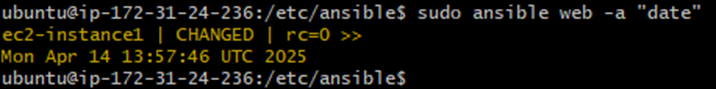

# Infrastructure As Code (IaC)

**Infrastructure as Code (IaC)** means setting up and managing your IT infrastructure (like servers, networks, databases) using **code** — instead of doing it manually (codifying the clicks).

---

## Instead of:
- Logging into AWS  
- Clicking to create a server  
- Installing software manually  

You write those steps in a script, and tools like **Terraform** or **AWS CloudFormation** will do it for you.

---

## Benefits of IaC
- **Speed** – Fast to set up infrastructure.
- **Reduce configuration errors** – Central config files allow mass changes.
- **Consistency & Accuracy** – Code reduces human error.
- **Repeatable** – Scripts can be reused and shared.
- **Scalable** – Easy to duplicate setups.
- **Trackable** – Version control systems can track infrastructure changes.

---

## Where to Use IaC?
Evaluate based on time/value:
If it takes 3 days to set up IaC but only 5 minutes to configure manually and it's done rarely, it may not be worth it.

---

## Configuration Management vs. Orchestration

### Configuration Management
"Set up and maintain individual machines"

- Change settings or install software on machines.
- **Example**: "Install NGINX on this server"
- **Tools**: Ansible, Puppet, Chef

### Orchestration
"Coordinate multiple machines to work together"

- Deploy full infrastructure and services in order.
- **Example**: "Deploy app, set up load balancer, start services"
- **Tools**: Terraform, Kubernetes, CloudFormation

**Analogy**:  
- *Config Management* = Set the table (plates, forks, glasses)  
- *Orchestration* = Serve the full meal in the right order

---

## Examples of Configuration Management Tools (CM):
- Ansible 
- Terraform  
- Chef  
- Puppet  

## How Ansible Works

1. You **write a playbook** (e.g. "Install NGINX on web servers").  
2. **Run the playbook** with Ansible.  
3. Ansible connects to target machines over **SSH** and applies the config.  
4. **No agents needed** – all control comes from the controller node.

---

## What Can Ansible Do?
- Install software  
- Configure servers  
- Start/stop services  
- Deploy apps  
- Enforce system settings (users, firewall, etc.)  

# IAC – Guide

## Plan
- Create Ansible controller instance
- Create target node
- Setup SSH connection from controller to target node (via Ansible)

---

## Create Controller Instance (Ansible Controller Node)
- Launch an instance using:
  - **Ubuntu (default image)**
  - Type: `t2.micro`
  - Use **existing key pair**
  - Default VPC with any **SSH-enabled security group**
- Note: Keep the **instance summary tab open** (you’ll need the **public IP**)

---

## Target Node
- Launch another identical instance:
  - Same image, type, key pair, and VPC
- Also keep the **summary tab open** for its public IP.

---

## Setting Up the Controller

### SSH into the Controller via Git Bash:

Open a GitBash window on your local machine and type the following commands to move into your ssh directory and connect to the controller node:

```
cd ~/.ssh
ssh -i your-key.pem ubuntu@<controller-ip>
```


### Install Ansible:

Usually you would need to install python on your instance. However, your instance was created using the default ubuntu image (not a custom one) so it should be installed by default. 

Python is essential for ansible so it's best to make sure. You can check by running the command:

`python2 --version`

Results should display:


#### Installing ansible on Controller Node:

`sudo apt update -y` - Refreshes the package list (connects to the internet and checks if you have latest installed packages )

`sudo DEBIAN_FRONTEND=noninteractive apt upgrade -y` - Upgrades installed packages without user prompts. It installs the latest packages that it was missing (that it foudn from previous command)

`sudo DEBIAN_FRONTEND=noninteractive apt-add-repository ppa:ansible/ansible` - Adds the official Ansible PPA to your sources list (Adds ansible to the list of things to install). 

`sudo DEBIAN_FRONTEND=noninteractive apt install ansible -y` - Installs Ansible.

`ansible --version` - Verifies it installed and prints version of ansible installed.


---

## Ansible Setup
## Open a New GitBahs Window

Inside this window you are going to find your AWS private key which is the ".pem" file.

Run the following commands to move into the .ssh directory:

````
cd ~
cd .ssh
````
Once in the .ssh directory print the contents of the AWS private SSH key to the terminal using the following command:

`cat <name of AWS private key>`

Copy the contents of the key and run the `clear` command to clear it as it is crucial this is kept secure. 

### Move Back to Controller Node GitBash Window
### Navigate to Ansible Config file:

```
cd /etc/ansible
ls
```

### Set Up SSH Key:

Once inside the /etc/ansible directory create a file and name it the same name as the AWS key to keep naming consistent. In my case:


`sudo nano TECH503-aaron-aws-key.pem`

Once nano'd into the file paste the private key contents into this file, save and exit. 

This means that the controller node now has the private key, which is necessary to connect to the target node as it has the public key.

For best practice - Change the permissions of the file (as it includes a private key) to only allow the owner to read the contents of the file:

`sudo chmod 400 <name of file>`

---

## Connect to Target Node

### From Controller Node GitBash Window:

Paste the ssh command from the target node (AWS Instance) found in the "connect" tab on the AWS page for the target instance.


```
ssh -i ~/.ssh/TECH503-aaron-aws-key.pem ubuntu@<target-ip>

If previous steps were done correctly the connection should be successful and so you should have connected to the target node through SSH from the controller node. 

This was done to test the key pair worked.

Checking `ansible --version` should demonstrate it is not installed which shows you are on the target node as it shouldn't be installed on here.

```
- If successful, exit back to the controller node:
```
exit
```


The idea was to only test the connection. Main reason to use ansible is to enable you to make changes (run commands) on multiple machines without the need to SSH into them directly.

---

## Configure Ansible Inventory on Controller Node

### Edit Hosts File:
```
sudo nano /etc/ansible/hosts
```

#### Add this at the bottom:

Scroll to the bottom of the file:

```
[web]
ec2-instance ansible_host=<target-ip> ansible_user=ubuntu ansible_ssh_private_key_file=/home/ubuntu/.ssh/<name of private key file you created earlier>
```
- This defines a host (ec2-instance) in the web group for Ansible to manage. It tells Ansible:

- ansible_host: IP address of the target machine

- ansible_user: SSH username (ubuntu)

- ansible_ssh_private_key_file: Path to the SSH private key used to connect

It lets Ansible connect to and control that specific machine.


---

## Test Connection to Target Node Using Ansible

This time you are testing the connection to the target node using ansible.

```
sudo ansible all -m ping
sudo ansible web -m ping
```
- "Ansible" = package we want to use
- "all" = all groups set / "web" = web group
- "-m" = module  
- "Ping" = module we want to use 

This command allows you to test the connection to the target node/s (all of them or specific nodes inside a specific gorup)


---

## Optional: Remove Color (Purple Text)
 
The purple text (warning) that appears can be distracting. It is option to run the below command to remove it for future commands.

Edit config:
```
sudo nano /etc/ansible/ansible.cfg
```
Add this to the bottom of the file:

```
[defaults]
interpreter_python = auto_silent
```


This will stop the purple text warning from appearing after running ansible adhoc commands.

---

## Inventory Commands

`ansible-inventory --list` - Lists all inventory hosts in JSON.

`ansible-inventory --graph` - Shows inventory as a tree.

---

## Test Running Some Ad-hoc Commands

They let you run quick, one-off tasks on multiple servers without writing a playbook. IN my case just one server, but could be hundreds at once.

Example – Install NGINX on all web servers which you oculd do using the command:

`sudo ansible web -m apt -a "name=nginx state=present update_cache=yes" --become`

This installs NGINX on every instance in the web group at once.

More adhoc commands you could test are:


`sudo ansible web -a "uname -a"` - Runs uname -a on all machines in the web group to show system info


`sudo ansible web -a "date"` - Runs date on all web servers to show current date and time.



`sudo ansible web -m ansible.builtin.apt -a "update_cache=yes" --become` - Uses the apt module to update the package cache (like apt update) on all web servers with sudo.

`sudo ansible web -m ansible.builtin.apt -a "upgrade=dist" --become` - Upgrades all packages (like apt upgrade) on all web servers with sudo.

Note: 

Ansible runs commands sequentially across instances.  

Best with **vertical scaling** of controller, **horizontal scaling** of infastructure.

---

## Default Ansible Config (Reference)
[GitHub: ansible.cfg example](https://github.com/ansible/ansible/blob/stable-2.9/examples/ansible.cfg)
